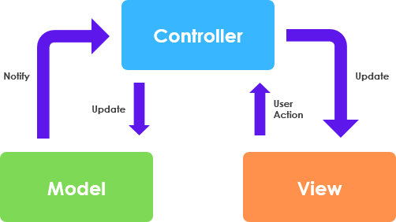

# Dokumentation
Dette er min egen dokumentation af Java Webstack. 
Vi skal lave et Intranet og vil bruge denne dokumentation til at huske hvad vi lavede.

## Start af et nyt webprojekt

1. Opret nyt projekt i IntelliJ
2. Vælg JavaEnterprise projektskabelon.
3. Java + Maven
4. Servlet.

## Arkitektur
Vi anvender en slags MVC-pattern.

- M(odel) - Entiteter, Hjælpe-metoder og klasser
- V(iew) - JSP og Frontend (css, bootstrap mm)
- C(ontrol) - Servlets

Husk! Ingen kommunikation mellem Model og View. Gå altid igennem Controlleren.